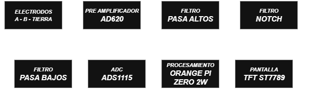

# DETECCIÓN DE ANOMALÍAS CARDÍACAS
*El presente proyecto académico tiene como objetivo diseñar un dispositivo capaz de detectar anomalías cardíacas mediante procesamiento digital de señales cardioeléctricas.*

  

## Índice
- [PLACA ECG](#placa-ecg)
  - [Amplificador AD620](#amplificador-ad620)
  - [Filtros](#filtros)
- [CONVERSOR ANALÓGICO-DIGITAL ADS1115](#conversor-analógico-digital-ads1115)
  - [Configuración del ADS1115](#configuración-del-ads1115)
- [UNIDAD PRINCIPAL DE PROCESAMIENTO](#unidad-principal-de-procesamiento)
  - [Funcionalidades](#funcionalidades)
  - [Características](#características)
- [PANTALLA TFT CON MODULO ST7789](#pantalla-tft-con-modulo-st7789)
  - [Conexiones con la SBC](#conexiones-con-la-sbc)

## *PLACA ECG*
La placa ECG (Electrocardiograma) es un circuito diseñado para obtener, filtrar y amplificar las señales cardioeléctricas del corazón para que puedan ser leídas por un conversor analógico-digital (ADC) ADS1115.

### Amplificador AD620
El componente encargado de obtener las señales cardioeléctricas es el amplificador operacional (OpAmp) de instrumentación AD620. Este OpAmp preamplifica (ganancia de 7) la diferencia de voltaje entre dos electrodos, 
elimina el ruido y las señales comunes presentes.
Los electrodos están conectados en posiciones específicas del pecho o brazos.

### Filtros
Se utilizan tres tipos de filtros:
- *Filtro Pasa Altos*: permite el paso de frecuencias superiores a 0.5 Hz y elimina el ruido generado por la deriva de continua, la respiración y el movimiento del paciente.
- *Filtro Pasa Bajos*: permite el paso de frecuencias inferiores a 40 Hz y atenúa interferencias generadas por dispositivos electrónicos externos.        
- *Filtro Notch*: elimina la componente de 60 Hz asociada a la red eléctrica doméstica.

Finalmente se amplifica la señal acondicionada con un amplificador no inversor (ganancia variable).

## *CONVERSOR ANALÓGICO-DIGITAL ADS1115*
El **ADS1115** es un ADC de 16 bits con interfaz I2C y amplificador PGA programable. Se utiliza para la adquisición de la señal analógica acondicionada de la placa ECG.

Presenta las siguientes características:
- Amplificador de ganancia programable (PGA).
- Multiplexor con cuatro canales independientes (A0, A1, A2 y A3).
- Tasa de muestreo configurable (SPS).
- Modo de conversión continua y modo de conversión simple (single-shot).

### Configuración del ADS1115
- Rango del PGA: ±1.024 V, seleccionado de acuerdo con la amplitud máxima de la señal analógica acondicionada proveniente de la placa ECG, evitando saturación y maximizando la resolución.
- Configuración diferencial A0 vs A1: A0 corresponde a la señal ECG y A1 a la referencia de tierra (GND) de la placa ECG.
- Tasa de muestreo de 860 SPS: elegida para preservar la información relevante de la señal electrocardiográfica.
- Modo de lectura continua: permite la adquisición continua de datos sin interrupciones.

## *UNIDAD PRINCIPAL DE PROCESAMIENTO*
Se utiliza una SBC (Single Board Computer) Orange Pi Zero 2W (OPi2W) como unidad principal de procesamiento del sistema. Esta SBC recolecta los datos del ECG a través del modulo ADS1115. La OPi2W procesa la señal y la muestra en una pantalla SPI, incluyendo frecuencia cardíaca, posibles anomalías.

### Funcionalidades
 - Adquisición de señales ECG mediante el ADC ADS1115.
 - Procesamiento digital de la señal.
 - Visualización de la frecuencia cardíaca y anomalías cardíacas.
 - Representar gráficamente la señal en tiempo real en pantalla SPI.

### Características
- Sistema Operativo: *Armbian 25.5.1 minimal*
- Lenguaje de Programación: *C*
- Conexión: SSH

## *PANTALLA TFT CON MODULO ST7789*
La pantalla ST7789 permite la visualización en tiempo real de la señal ECG, facilitando el monitoreo inmediato del estado cardíaco del usuario sin necesidad de equipos externos.
### Características:
- Resolución: 170 x 320 px.
- Interfaz de comunicación: SPI.
- Alimentación de 3.3 - 5 V.

### Conexiones con la SBC:
| PIN | PANTALLA | OPi2W |
|-----|----------|-------|
| RELOJ | SCL | 230 |
| DATOS | SDA | 231 |
| RESET | RES | 259 |
| DATA / COMMAND | DC | 260 | 
| CHIP SELECT | CS | 229 |
| RETROILUMINACIÓN | BLK | 76 |

Keep It Simple, Stupid (KISS)

*Autor: URBINA ARÉVALO VITALY PAOLO (GALLETA)*

*Copyright (C) 2026 GALLETA*

*Este proyecto es software libre: puedes redistribuirlo y/o*
*modificarlo bajo los términos de la Licencia Pública General GNU*
*(GPL) publicada por la Free Software Foundation, versión 3 o posterior.*

*Este programa se distribuye con la esperanza de que sea útil,*
*pero SIN NINGUNA GARANTÍA; incluso sin la garantía implícita*
*de COMERCIALIZACIÓN o IDONEIDAD PARA UN PROPÓSITO PARTICULAR.*

*Para más detalles, consulta la licencia: [GPL v3](https://www.gnu.org/licenses/gpl-3.0.html)*
